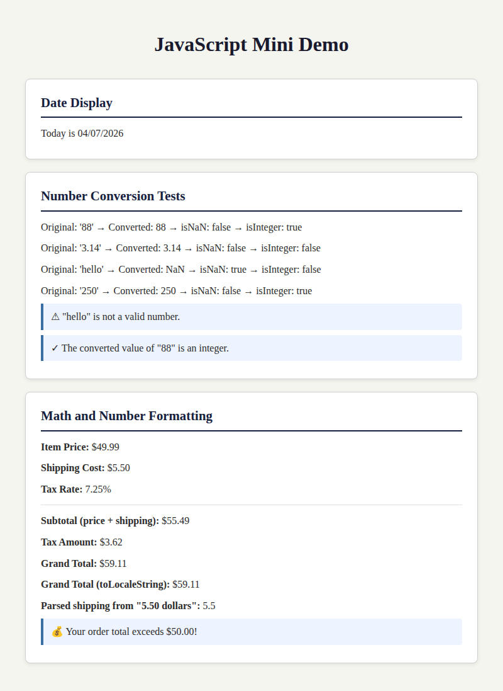

# JavaScript Mini Demo

## COMP 484 — Homework 9

## GitHub Pages Link

[Live Demo](https://YOUR_USERNAME.github.io/YOUR_REPO_NAME/)

> Replace the link above with your actual GitHub Pages URL after enabling it.

## Built-In Objects and Methods Used

- `Date()` — create a Date object for the current date and time
- `Date.getMonth()` — get the current month (0-based)
- `Date.getDate()` — get the current day of the month
- `Date.getFullYear()` — get the four-digit year
- `String.padStart()` — add leading zeros to single-digit months/days
- `Number()` — convert string values to numbers
- `Number.isNaN()` — check if a converted value is NaN
- `Number.isInteger()` — check if a value is a whole number
- `Number.toFixed()` — format a number to a fixed number of decimal places
- `Number.toLocaleString()` — format a number with locale-aware currency styling
- `Number.parseFloat()` — parse a floating-point number from a string

## Screenshot

## Reflection

The easiest part of this assignment was setting up the HTML structure and linking the external JavaScript file, since the starter code provided a clear foundation. The hardest part was making sure the date formatting always produced two-digit months and days, which required understanding that `getMonth()` is zero-based and using `padStart()` for padding. I learned that the `Date` object in JavaScript stores months starting at index 0, so January is 0 and December is 11, which means you always need to add 1 when displaying the month. Working with the `Number` object taught me that `Number()` returns `NaN` for non-numeric strings, and methods like `isNaN()` and `isInteger()` are useful for validating user input before doing math. Finally, I learned that using `innerHTML` lets you inject formatted HTML directly into the page, which is more flexible than `textContent` when you want to display structured results with tags like `
` and `<strong>`.

## Extra Credit

- Added CSS styling so each section appears as a separate card/panel with subtle shadows and borders.
